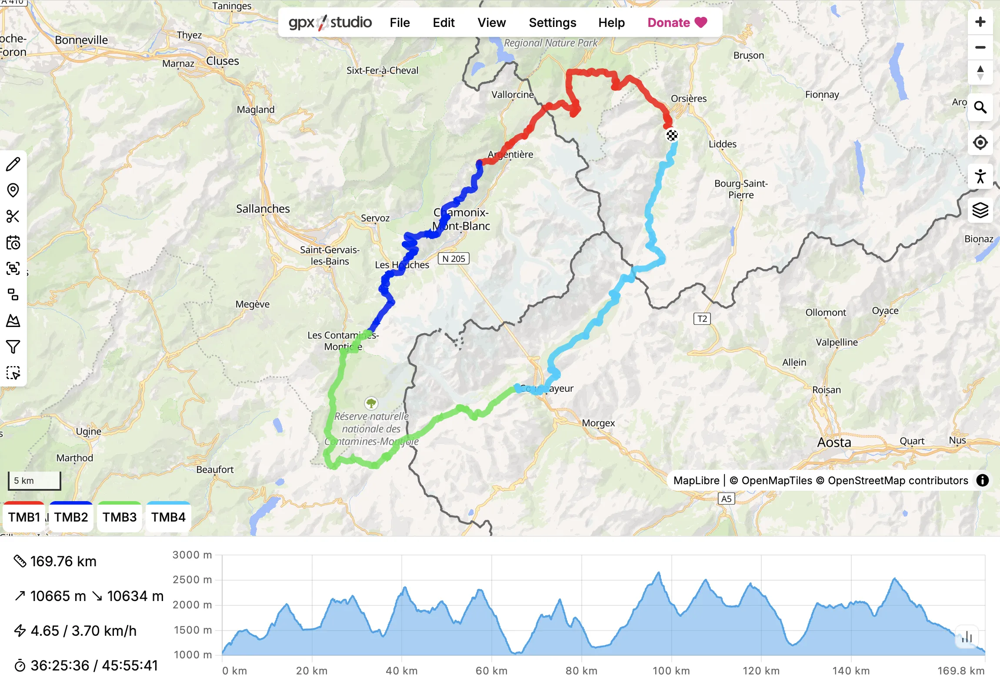

<picture>
  <source media="(prefers-color-scheme: dark)" srcset="website/static/logo-dark.svg">
  
</picture>

condottiere, based on [**gpx.studio**](https://gpx.studio), an online tool for creating and editing GPX files.



This repository contains the source code of the website.

## Contributing

Please create an issue if you find a bug or have a feature request.

Code contributions are also welcome, but except for obvious bug fixes, please open an issue first to discuss the changes you would like to make.

## Translation

The website is translated by volunteers on a collaborative translation platform.
You can help complete and improve the translations by joining the [Crowdin project](https://crowdin.com/project/gpxstudio).
If you would like to start the translation in a new language, please contact me or create an issue.

Any help is greatly appreciated!

## Development

The code is split into two parts:

- `gpx`: a Typescript library for parsing and manipulating GPX files,
- `website`: the website itself, which is a [SvelteKit](https://kit.svelte.dev/) application.

You will need [Node.js](https://nodejs.org/) to build and run these two parts.

### Building the `gpx` library

```bash
cd gpx
npm install
npm run build
```

### Running the website

To be able to load the map, you will need to create your own <a href="https://cloud.maptiler.com/auth/widget?next=https://cloud.maptiler.com/maps/" target="_blank">MapTiler key</a> and store it in a `.env` file in the `website` directory.

```bash
cd website
echo PUBLIC_MAPTILER_KEY={YOUR_MAPTILER_KEY} >> .env
npm install
npm run dev
```

## Deployment

### Vercel

The project can be deployed to Vercel as a monorepo. The `gpx` library must be built before the `website`.

1. Import the repository in the Vercel dashboard and set the **Root Directory** to the repository root (leave blank).

2. Add the following environment variable under **Settings → Environment Variables**:

   ```
   PUBLIC_MAPTILER_KEY=your_maptiler_key
   ```

3. Place this `vercel.json` in the **root of the repository**:

   ```json
   {
     "buildCommand": "cd gpx && npm install && npm run build && cd ../website && npm install && npm run build",
     "outputDirectory": "website/build",
     "installCommand": "echo skip"
   }
   ```

4. Push to your main branch — Vercel will pick up the configuration automatically.

> **Note:** the `website` uses `@sveltejs/adapter-static`. If you have routes that are not pre-rendered (e.g. `/app`), add a fallback in `website/svelte.config.js` and a rewrite rule in `vercel.json`:
>
> ```js
> // svelte.config.js
> adapter({ pages: 'build', assets: 'build', fallback: 'index.html', strict: false })
> ```
>
> ```json
> // vercel.json — add inside the root object
> "rewrites": [{ "source": "/(.*)", "destination": "/index.html" }]
> ```

## API

The website exposes a REST endpoint for generating GPX files programmatically from a list of points of interest.

### `POST /api/gpx`

Returns a `.gpx` file built from the provided POIs.

**Request body (JSON):**

| Field | Type | Required | Description |
|---|---|---|---|
| `pois` | array | ✅ | List of points of interest (max 500) |
| `pois[].lat` | number | ✅ | Latitude in decimal degrees `[-90, 90]` |
| `pois[].lon` | number | ✅ | Longitude in decimal degrees `[-180, 180]` |
| `pois[].name` | string | — | Waypoint name |
| `pois[].desc` | string | — | Waypoint description |
| `pois[].ele` | number | — | Elevation in meters |
| `pois[].sym` | string | — | GPX symbol name (e.g. `"Flag, Blue"`) |
| `name` | string | — | GPX file and track name (default: `"Generated route"`) |
| `description` | string | — | Metadata description |
| `create_track` | boolean | — | Connect POIs as a `<trk>` in order (default: `true`) |
| `color` | string | — | Hex color for the track line (e.g. `"0055ff"`) |

**Example request:**

```bash
curl -X POST https://your-site.vercel.app/api/gpx \
  -H "Content-Type: application/json" \
  -d '{
    "name": "Giro del centro storico",
    "description": "Tour a piedi dei principali monumenti",
    "create_track": true,
    "color": "0055ff",
    "pois": [
      { "lat": 43.1122, "lon": 12.3888, "name": "something", "ele": 493 },
      { "lat": 43.1105, "lon": 12.3910, "name": "something", "ele": 490 },
      { "lat": 43.1135, "lon": 12.3875, "name": "something", "ele": 500 }
    ]
  }' \
  --output route.gpx
```

**Response:** `application/gpx+xml`, the generated GPX file as a download.

Each POI is added as a `<wpt>` (visible waypoint on the map). When `create_track` is `true`, a `<trk>` connecting all POIs in order is also included, with optional `gpx_style:line` color styling compatible with gpx.studio.

### `GET /api/gpx`

Returns a JSON description of the endpoint and a usage example.

### File location

The endpoint is implemented in:

```
website/src/routes/api/gpx/+server.ts
```

## Credits

This project has been made possible thanks to the following open source projects:

- Development:
    - [Svelte](https://github.com/sveltejs/svelte) and [SvelteKit](https://github.com/sveltejs/kit) — seamless development experience
    - [MDsveX](https://github.com/pngwn/MDsveX) — allowing a Markdown-based documentation
- Design:
    - [shadcn-svelte](https://github.com/huntabyte/shadcn-svelte) — beautiful components
    - [@lucide/svelte](https://github.com/lucide-icons/lucide/tree/main/packages/svelte) — beautiful icons
    - [tailwindcss](https://github.com/tailwindlabs/tailwindcss) — easy styling
    - [Chart.js](https://github.com/chartjs/Chart.js) — beautiful and fast charts
- Logic:
    - [immer](https://github.com/immerjs/immer) — complex state management
    - [Dexie.js](https://github.com/dexie/Dexie.js) — IndexedDB wrapper
    - [fast-xml-parser](https://github.com/NaturalIntelligence/fast-xml-parser) — fast GPX file parsing
    - [SortableJS](https://github.com/SortableJS/Sortable) — creating a sortable file tree
- Mapping:
    - [MapLibre GL JS](https://github.com/maplibre/maplibre-gl-js) — beautiful and fast interactive map rendering
    - [GraphHopper](https://github.com/graphhopper/graphhopper) — powerful routing engine
    - [OpenStreetMap](https://www.openstreetmap.org) — open map data used by most of the map layers, and by the routing engine
    - [Mapterhorn](https://github.com/mapterhorn/mapterhorn) — high-quality open terrain data used by some map layers (including for 3D), and by the routing engine
- Search:
    - [DocSearch](https://github.com/algolia/docsearch) — search engine for the documentation

## License

This project is licensed under the MIT License - see the [LICENSE](LICENSE) file for details.
